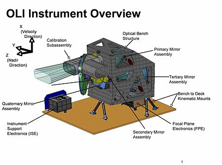
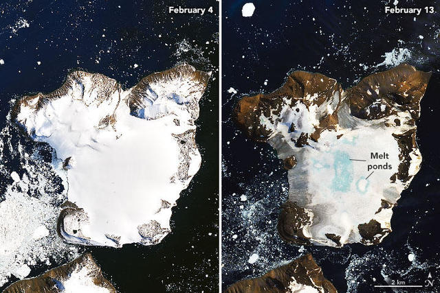

# Summary: Overview

Operational Land Imager (OLI) is an  sensor that is used on Landsat 8 and Landsat 9 satellites built by the Ball Aerospace & Technologies Corporation. 

* It is a push broom type of sensor that plays a crucial role in Earth observation and remote sensing. 

* It has a five-year design life. 

* The entire Earth falls within view once every 16 days.

.pull-left[
  
]

---

# Summary: How does it work?

It measures in the visible, near infrared, and short wave infrared portions of the spectrum as well as a panchromatic band
* Its images have 30-meter multi-spectral spatial resolutions along a 185 km wide swath, covering wide areas of the Earth’s landscape while providing sufficient resolution to distinguish features like urban centers, farms, forests and other land uses
* It has a four-mirror telescope and 12-bit quantization

---

# Summary: Push Broom  Scanner

A push broom scanner (an along-track scanner), is a device that captures images with the use of spectroscopic sensors. 

Advantages

* A significant advantage of push broom scanners over whisk broom scanners is their ability to gather more light by focusing on a specific area for an extended period, like a long exposure on a camera. 
This feature is particularly beneficial for capturing images under difficult lighting conditions and for observing subtle features on the Earth's surface.

Challenges

* Sensitivity of the individual detectors - this variance can affect image uniformity and quality, requiring calibration and correction during image processing.
* Resolution is lower than a whisk broom scanner because the entire image is captured at once.

---

# Applications

The images and data that OLI has helped collect have practical applications today in:
* environmental monitoring (e.g. monitoring changes in snow, ice, and water)
* urban planning
* disaster management
* agriculture

---

# Applications: Environmental Monitoring

* Climate Change Studies: OLI's data assists in tracking the impacts of climate change by monitoring glacier retreat, changes in snow cover, and the health of global vegetation.
Water Resource Management: By observing water quality, extent, and usage, OLI supports the sustainable management of freshwater resources. It aids in identifying pollution sources, tracking sediment transport, and mapping wetland changes.
* Agriculture Optimization: OLI data is pivotal for precision agriculture, enabling farmers to monitor crop health, optimize irrigation, and improve yield predictions. It assists in detecting crop stress early, guiding efficient resource use.
* Forest and Wildlife Conservation: The instrument's ability to map forest cover changes and habitat fragmentation is invaluable for conservation efforts, helping to combat deforestation and preserve biodiversity.

---

# Applications: Urban Planning

* OLI can support urban planners in mapping city growth, land use changes, and infrastructure development which as a consequence improves planning sustainability and decreses environmental impact
* OLI's rapid data collection enables effective damage assessment, aiding in the coordination of relief efforts and long-term disaster recovery planning.
* Coastal areas benefit from OLI's surveillance, which helps in erosion studies, coastal defense planning, and the monitoring of sea-level rise effects.
* Heritage Conservation: By providing detailed images of historical sites and landscapes, OLI contributes to the preservation of cultural heritage against the challenges posed by natural decay and human-induced changes

---

# Applications: Agriculture

* Deep insights into crop health, soil conditions, and water usage.

* Crop Health Monitoring: OLI enables the detection of subtle variations in plant health by analyzing reflected light across various spectral bands. This capability allows for the identification of stressed vegetation, disease presence, or nutrient deficiencies early in the crop cycle, facilitating timely intervention to protect yields.

* Irrigation Management: By assessing crop water stress and monitoring irrigation practices, OLI data helps in optimizing water use. This is crucial for conserving water resources while ensuring crops receive adequate hydration. The imagery can highlight areas of both over and under-irrigation, guiding improvements in irrigation systems and strategies.

* Precision Agriculture: Leveraging OLI imagery, farmers and agronomists can practice precision agriculture—applying the right treatment, at the right place, at the right time. This approach minimizes waste, reduces environmental impact, and increases productivity by tailoring farming practices to the specific needs of each plot.

* Yield Estimation and Prediction: The detailed data provided by OLI assists in estimating and predicting crop yields more accurately. Analyzing historical and current satellite data helps in understanding crop performance trends and making informed decisions for future planting seasons.

* Sustainable Agriculture: OLI's comprehensive monitoring capabilities support the advancement of sustainable agricultural practices. By providing insights into crop rotation effectiveness, land use changes, and degradation, OLI data helps in maintaining soil health, reducing chemical inputs, and increasing farm resilience to climate variability.

---

# Reflections

The Operational Land Imager (OLI) on Landsat 8 symbolizes a remarkable leap forward in our ability to observe and understand the Earth's surface. Through its sophisticated imaging capabilities, OLI not only enhances our comprehension of environmental dynamics but also bridges the gap between scientific knowledge and practical application, especially in critical areas like agriculture, water management, and environmental conservation. Its high-resolution, multispectral data provides an invaluable resource for monitoring changes over time, offering insights that can lead to more informed decisions and sustainable practices. Reflection on OLI's contributions evokes a sense of optimism about the potential for technology to address some of the most pressing challenges facing our planet. It underscores the importance of continued investment in Earth observation technologies, as the data they provide plays a pivotal role in guiding policy, advancing scientific research, and promoting a more sustainable interaction with our natural environment. In this light, OLI is not just a tool for observation but a beacon of hope for future generations, illuminating paths towards environmental stewardship and resilience.

---
# References

Add references everywhere!!
